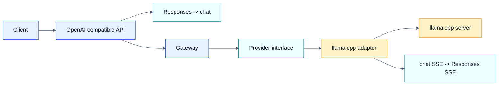

# Nexus

Nexus is a small AI gateway written in Go. It exposes an OpenAI-compatible API and forwards requests to a backend provider.

Today the backend is `llama.cpp`. Nexus keeps the client-facing API stable while the backend remains replaceable.

## Current Scope

- `GET /health`
- `GET /v1/models`
- `POST /v1/chat/completions`
- `POST /v1/responses`
- `GET /metrics`
- built-in structured logging and Prometheus metrics
- gzip and zstd request decompression
- compatible with Codex CLI

Current limits:

- one provider in practice: `llama.cpp`
- only one provider is selected at startup
- Responses support is a narrow text-oriented subset

## Architecture



The key design choice is to keep the provider contract small. Providers only need to list models and serve chat completions. Nexus handles the Responses compatibility layer around that.

## Run

Requirements:

- Go `1.25.5` or newer
- a `llama.cpp` server reachable at the configured `NEXUS_LLAMACPP_URL`

Run Nexus:

```bash
go run ./cmd/nexus
```

Current defaults:

- Nexus listens on `:9000`
- provider is `llama.cpp`
- `llama.cpp` is expected at `http://192.168.1.11:8080`

Environment variables:

```bash
NEXUS_PORT=:9000
NEXUS_PROVIDER=llama.cpp
NEXUS_LLAMACPP_URL=http://192.168.1.11:8080
```

Health check:

```bash
curl http://localhost:9000/health
```

Chat request:

```bash
curl http://localhost:9000/v1/chat/completions \
  -H 'Content-Type: application/json' \
  -d '{
    "model": "model.gguf",
    "messages": [
      {"role": "user", "content": "Write a haiku about Go."}
    ]
  }'
```

Responses request:

```bash
curl http://localhost:9000/v1/responses \
  -H 'Content-Type: application/json' \
  -d '{
    "model": "model.gguf",
    "instructions": "Be concise.",
    "input": [
      {
        "role": "user",
        "content": [
          {"type": "input_text", "text": "Explain what Nexus does."}
        ]
      }
    ]
  }'
```

## Development

Useful commands:

```bash
go fmt ./...
go vet ./...
go test ./...
```

Or:

```bash
make fmt
make vet
make test
make lint
make check
```

## Roadmap

- move runtime settings into explicit configuration
- support multiple providers and routing
- broaden Responses compatibility
- improve error normalization
- add provider and stream translation tests

Notes:

- The internal/types package represents Nexus's internal model, not any provider's API.
